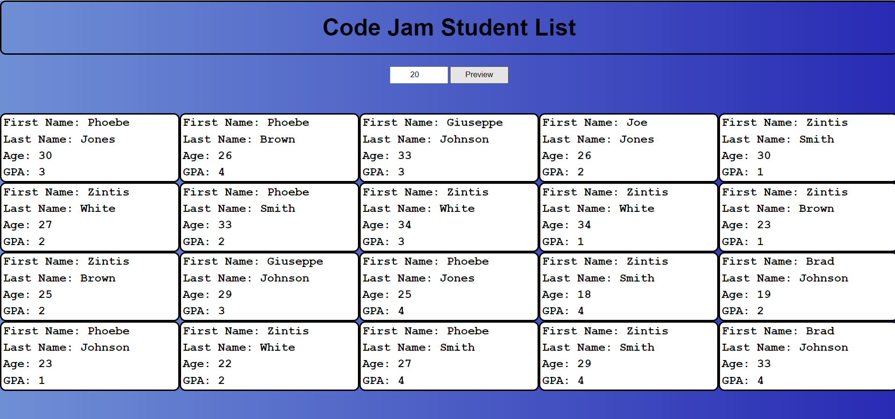

# code-jam-student-list

repo link: https://github.com/bradfan/code-jam-student-list

deployed link: https://bradfan.github.io/code-jam-student-list/

This was a voluntary exercise hosted by Zintis May-Krumins with some of his past students. The task was to render a fictional random list of students to a simple web application. This exercise in fundamental javascript, HTML and CSS helped to reinforce some older skills that may not always be used in more complex applications.

